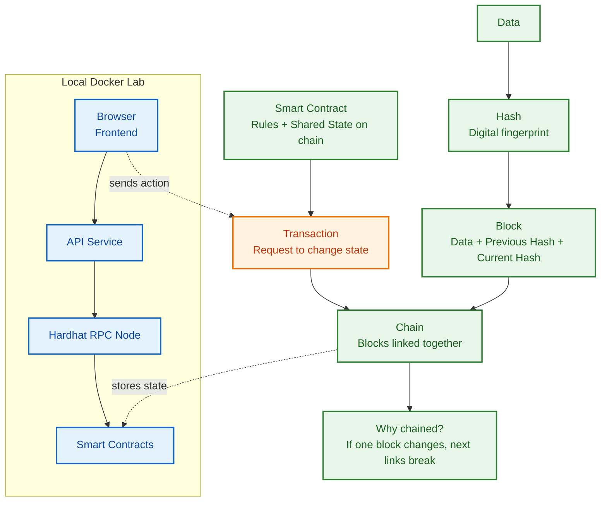
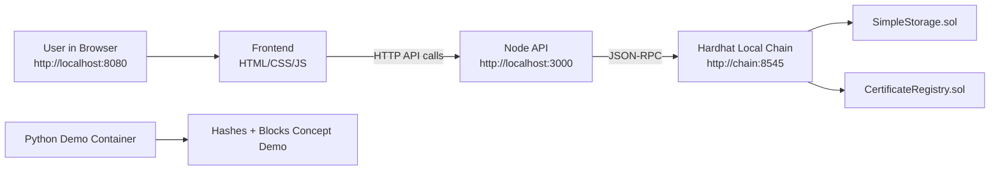
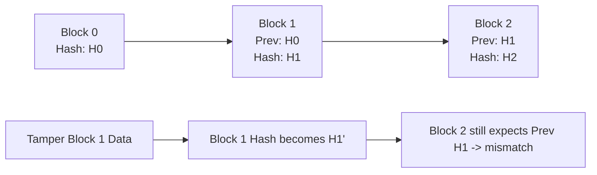
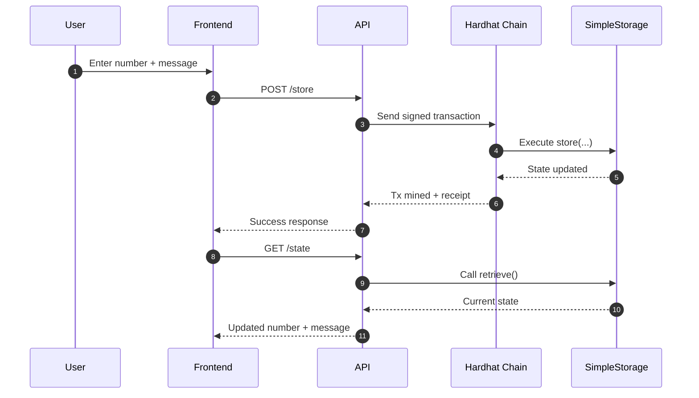
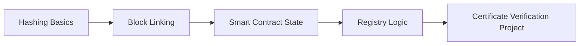

# Lab 1 Master Guide (Simple + Visual)


Goal: help you understand Lab 1 from zero, run it successfully, and know the meaning of each part.

## Purpose First: Why We Are Doing All This

Before tools and commands, this is the real purpose of Lab 1:

### 1) Fix the foundation early
understand hash, block, chaining, smart contract, and transaction

### 2) Turn theory into something you can see
run a full local stack and watch state change live in the browser. (concepts real and easier to remember)

### 3) Build confidence in the workflow
practice the actual development flow used in real projects:
- run chain
- deploy contracts
- call contract through API
- verify results in frontend

### 4) Understand the trust problem blockchain solves
Normal records can be edited silently.
Blockchain makes changes auditable because:
- data is hashed
- blocks are linked
- tampering creates visible mismatch

In short: Lab 1 is not about "just running Docker." It is about building the mental model and practical flow you will reuse for the full course project.

---

## 1. What You Will Learn

By the end of Lab 1, you should be able to explain:
- what a hash is
- what a block is
- why blocks are chained
- what a smart contract is
- what a transaction is
- how the local Docker lab works from browser to blockchain

You will also run everything locally and see live blockchain state updates.

---

## 2. Big Picture (One-Minute Version)

Lab 1 has 4 parts:
1. Python demo: learn hashes + block chaining.
2. Hardhat node: run a local Ethereum blockchain.
3. Deploy contracts: put Solidity code on local chain.
4. Frontend + API: read and update contract state from browser.

---

## First (Super Simple)

Use this script before showing the concept diagram.

### a story
Imagine you have a notebook where you write important class records.
If someone secretly changes page 2 at night, how do we know?

Blockchain is like a smart notebook that can reveal that cheating.

### Hash = magic fingerprint
Every page gets a fingerprint called a hash.
- same page -> same fingerprint
- tiny change -> totally different fingerprint

So if someone changes one word, the fingerprint changes immediately.

### Block = one page in the notebook
A block is one page that has:
- the data
- its own fingerprint (hash)
- the previous page fingerprint

### Why blocks are chained
Each page says: "I am connected to the previous page fingerprint."
So pages are linked like a train.

If someone changes page 2:
- page 2 fingerprint changes
- page 3 still points to old page 2 fingerprint
- mismatch appears

That is how tampering becomes visible.

### Smart contract = robot rules on blockchain
A smart contract is not AI.
It is just a small robot program with fixed rules.

Example in this lab:
- store a number
- store a lesson message
- return saved values

### Transaction = "please update" message
A transaction is you asking the smart contract to change something.

Simple wording:
- read = "show me current value"
- transaction = "please save new value"


### One-line Summary
"Blockchain is a linked notebook where fingerprints protect trust, and transactions update shared records using clear rules."

---

## Concept Story (Before Architecture)



How to read this diagram:
- Hash turns data into a fingerprint.
- A block stores data and links to the previous block hash.
- Chaining makes tampering visible because links mismatch after changes.
- Smart contracts define on-chain rules and state.
- Transactions are the actions that update smart contract state.
- In Docker, browser -> API -> Hardhat node -> contracts is the execution path.

---

## 3. Visual Architecture



What this means:
- The browser does not write to blockchain directly.
- The API is the bridge that signs and sends transactions.
- Hardhat is your local blockchain network.
- Python demo is a concept simulator (not Ethereum).

---

## 4. Meaning of Everything (Simple Glossary)

### Blockchain
A shared ledger made of linked blocks. If someone edits past data, the chain consistency breaks and tampering becomes visible.

### Block
A container with:
- index/number
- timestamp
- data
- previous block hash
- current block hash

### Hash
A fixed fingerprint of data.
- same input -> same hash
- tiny input change -> very different hash
- used for integrity and tamper detection

### Previous Hash
The link to the previous block. This is what makes it a chain, not just a list.

### Smart Contract
Code that runs on blockchain and stores shared state.

In this lab:
- `SimpleStorage.sol`: saves a number + lesson message.
- `CertificateRegistry.sol`: preview of course direction.

### Transaction
A request to change blockchain state (for example, calling `store(...)`).

### Local Blockchain (Hardhat)
A private local Ethereum environment for learning.
- fast
- free
- no public network setup friction

### API
Backend service that:
- reads contract state
- signs transactions
- sends them to local chain

### Frontend
Web page where you:
- read current contract values
- submit new values
- see results after transaction mining

### Docker
Runs all services in isolated containers so you do not need to install every tool globally.

---

## 5. Why Hash Chaining Matters (Visualization)



Key idea:
- If Block 1 changes, its hash changes.
- Then Block 2 points to the wrong previous hash.
- Tampering is exposed.

---

## 6. Lab Services and Their Jobs

### `chain`
- Runs `npx hardhat node`.
- Provides local Ethereum RPC on port `8545`.

### `deployer`
- One-shot container.
- Compiles and deploys contracts.
- Writes deployment details.

### `api`
- Node.js backend on `3000`.
- Reads/writes contract state via chain RPC.

### `frontend`
- Static web UI served on `8080`.
- Calls API endpoints to display and update state.

### `pythonlab`
- Runs blockchain concept script for hash/block understanding.

---

## 7. End-to-End Flow (Visualization)



---

## 8. Step-by-Step: Run Lab 1

## Step 0: Prerequisites
You need:
- Docker Desktop running
- VS Code
- project folder opened

## Step 1: Start main containers

```bash
docker compose up -d chain api frontend pythonlab
```

## Step 2: Check containers

```bash
docker compose ps
```

Expected running services:
- `bc-lab1-chain`
- `bc-lab1-api`
- `bc-lab1-frontend`
- `bc-lab1-python`

## Step 3: Run Python concept demo

```bash
docker compose exec pythonlab python /workspace/labs/lab1/python/blockchain_demo.py
```

Look for:
- hashes printed per block
- tampered hash mismatch
- proof that tiny data changes create new hashes

## Step 4: Deploy contracts

```bash
docker compose run --rm deployer
```

This compiles and deploys `SimpleStorage` and `CertificateRegistry`.

## Step 5: Open frontend

Open:
- `http://localhost:8080`

You should see:
- concept cards
- chain health
- contract state
- form to send transaction

## Step 6: Check API health

Open:
- `http://localhost:3000/api/health`

You should see JSON like:
- `ok: true`
- block number
- rpc URL

## Step 7: Read state
On frontend, click refresh/read action and confirm current values.

## Step 8: Write state
Enter new number + message, submit transaction, then refresh state.

---

## 9. Point-by-Point

1. A hash is a data fingerprint.
2. A block stores data + previous hash link.
3. Changing one block breaks chain consistency.
4. Smart contracts store shared state.
5. Transactions update state.
6. Local chain is best for first learning cycle.
7. Same workflow later powers certificate verification.

---

## 10. What This Lab Proves (Concrete Results)

### Proof 1: Hash sensitivity is real
You can see original vs tampered hashes differ immediately.

### Proof 2: Chain linking exposes tampering
Changing a middle block causes previous-hash mismatch downstream.

### Proof 3: Smart contract state is live and shared
The frontend reads and updates blockchain state through API + transactions.

---

## 11. Common Misunderstandings (And Correct Meaning)

### "Blockchain is only cryptocurrency"
Not true. It is a data integrity and shared-trust model. Crypto is one use case.

### "Smart contract is AI-smart"
Not true. It is deterministic code with defined rules.

### "Blockchain data can never change"
State can change via valid transactions; history remains visible and auditable.

---

## 12. Troubleshooting Quick List

### Frontend opens but no contract data
Run deployer again:

```bash
docker compose run --rm deployer
```

### API not responding

```bash
docker compose logs api
```

### Chain not responding

```bash
docker compose logs chain
```

### Stop everything

```bash
docker compose down
```

---

## 13. Mini Practice Tasks

Pick one:
- change default number in contract
- change lesson message in UI
- change sample data in Python demo
- change one concept card text in frontend

---

## 14. Bridge to Labs 2-6

Lab 1 mental model:



This is why Lab 1 is small on purpose: it gives the exact foundation for the full certificate registry path.

---

## 15. Final Checklist

- can explain hash and block chaining.
- can run the Docker services.
- can deploy contracts locally.
- can read and write contract state from the browser.
- understand why this leads to certificate verification use cases.
