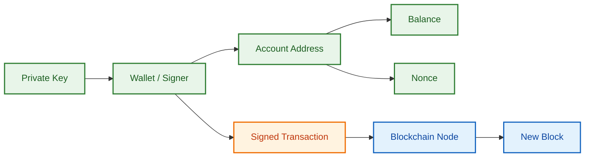
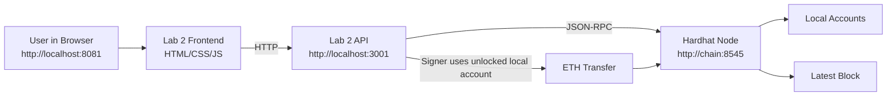
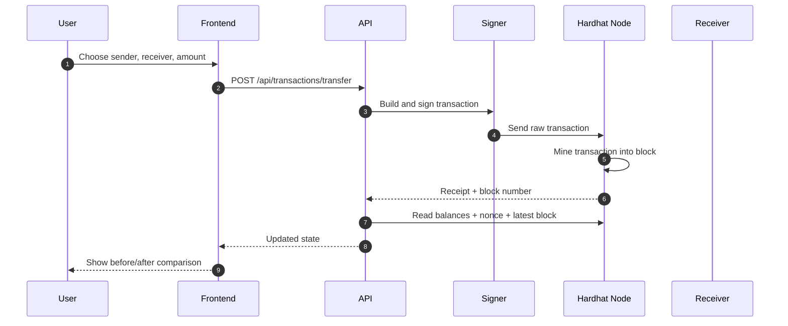
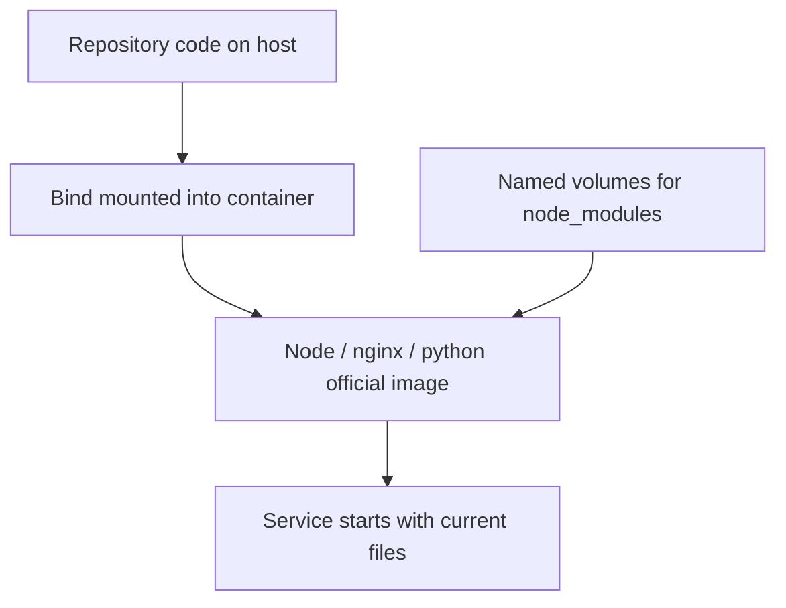
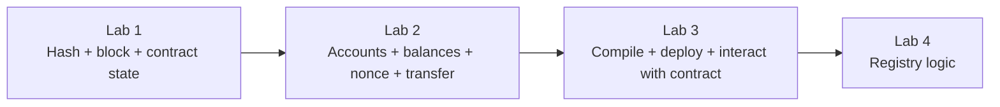

# Lab 2 Master Guide (Accounts + Transactions)

Goal: help students understand local Ethereum accounts, balances, nonces, and native ETH transfers before they build larger smart-contract workflows.

## 1. Why Lab 2 Comes Now

Lab 1 introduced:
- hashing
- blocks
- chaining
- smart-contract state

Lab 2 now answers a more basic question:

**who is actually sending a blockchain transaction?**

Before students write bigger contracts, they need to understand:
- what an account is
- what a wallet is
- what a signer does
- why balance changes
- why nonce changes
- how one simple transaction becomes a new block

This is why Lab 2 stays inside the same local Hardhat stack but removes contract complexity from the center of the lesson.

---

## 2. What Students Will Learn

By the end of Lab 2, students should be able to explain:
- the difference between an account, an address, a private key, a wallet, and a signer
- what a nonce is and why it increases
- how a native ETH transfer differs from a smart-contract call
- how sender and receiver balances change after a transaction
- how the API, signer, Hardhat node, and frontend work together

They should also be able to run a complete local transfer and describe exactly what changed on-chain.

---

## 3. Big Picture

Lab 2 has 4 practical parts:
1. inspect local Hardhat accounts
2. read balances and nonces from the API
3. send ETH from one local account to another
4. observe the new block, changed balances, and incremented nonce

---

## 4. One-Minute Story

Imagine four students share the same classroom blockchain network.

Each student has:
- an address
- some ETH
- a transaction counter

If Student A sends `0.25 ETH` to Student B:
- Student A balance decreases
- Student B balance increases
- Student A nonce increases by 1
- the chain records a new transaction hash
- the node mines that transfer into a block

That is the smallest real blockchain workflow that still teaches identity, value movement, validation, and ordering.

---

## 5. Core Concept Diagram



How to read it:
- the private key controls the wallet
- the wallet acts as signer
- the signer sends a signed transaction
- the chain validates and mines it
- balance and nonce are account state that students can measure

---

## 6. Lab 2 Architecture



What this means:
- the browser never signs directly in this lab
- the API selects one local Hardhat account as signer
- the transaction goes to the Hardhat node
- the node mines it and the frontend reads the new state back

---

## 7. Transaction Lifecycle



---

## 8. What Was Added or Changed in the Repo

### New files added
- `docs/lab2/Lab2.md`
- `labs/lab2/api/package.json`
- `labs/lab2/api/src/server.js`
- `labs/lab2/frontend/index.html`
- `labs/lab2/frontend/app.js`
- `labs/lab2/frontend/styles.css`

### Existing files updated
- `docker-compose.yml`
- `README.md`
- `labs/lab2/README.md`
- `docs/lab1/Lab1.md`
- `labs/lab1/README.md`

Why these changes matter:
- Lab 2 needs its own frontend and API so it can focus on accounts and transactions instead of contract state.
- Compose was changed so normal code edits do not require rebuilding custom images every time.
- Older docs that still said `--build` were corrected so the workflow stays consistent.

---

## 9. Why Docker Compose Was Changed

You asked for a workflow where code changes are saved and then picked up by:

```bash
docker compose up -d ...
```

without rebuilding images each time.

That is now supported by design:



Meaning:
- source code is mounted directly from the workspace
- containers run official base images
- dependency folders stay in Docker volumes
- rebuilds are only needed if you change image-level setup, not normal code

---

## 10. Lab 2 Services and Their Jobs

### `chain`
- runs `npx hardhat node`
- exposes local RPC on `8545`
- provides local funded accounts

### `lab2-api`
- runs Express + ethers
- reads account balances and nonces
- signs and sends local transfers
- reads latest block state

### `lab2-frontend`
- serves the Lab 2 teaching UI on `8081`
- shows account cards, latest block, transaction flow, and before/after results

---

## 11. Step-by-Step: Run Lab 2

## Step 0: Prerequisites
- Docker Desktop running
- the project opened

## Step 1: Start the Lab 2 services

```bash
docker compose up -d chain lab2-api lab2-frontend
```

Important note:
- no `--build` is needed for normal lab work

## Step 2: Check containers

```bash
docker compose ps
```

Look for:
- `bc-lab1-chain`
- `bc-lab2-api`
- `bc-lab2-frontend`

## Step 3: Open the frontend
- `http://localhost:8081`

## Step 4: Check API health
- `http://localhost:3001/api/health`

Expected:
- `ok: true`
- `chainId: 31337`
- current `blockNumber`

## Step 5: Inspect local accounts

Students should observe:
- each account has ETH
- each account has a nonce
- all of this is readable from the same chain

## Step 6: Send a small transfer

Example:
- sender: Account 1
- receiver: Account 2
- amount: `0.25`

## Step 7: Observe the change

Students should confirm:
- sender balance decreased
- receiver balance increased
- sender nonce increased by 1
- latest block changed
- transaction hash appeared

---

## 12. API Endpoints in This Lab

### `GET /api/health`
Purpose:
- prove the API can reach the Hardhat node
- return chain id and latest block

### `GET /api/foundation`
Purpose:
- send teaching content to the frontend
- provide objectives, concept cards, stages, and rules

### `GET /api/accounts`
Purpose:
- return the local account snapshot
- balance
- nonce
- role label

### `GET /api/blocks/latest`
Purpose:
- return the latest block summary
- show transaction count and latest transfer

### `POST /api/transactions/transfer`
Purpose:
- send native ETH between two local accounts
- return before/after balances and nonce changes

---

## 13. File-by-File Explanation

## A. `docker-compose.yml`

What changed:
- switched services from custom `build:` usage to official `image:` usage for normal runs
- kept source code mounted into containers
- added named volumes for `node_modules`
- added two new services: `lab2-api` and `lab2-frontend`

Why:
- code changes are picked up by `docker compose up -d`
- Lab 2 can run separately from Lab 1 on different ports

## B. `labs/lab2/api/package.json`

Purpose:
- defines the runtime dependencies for the Lab 2 API

Why these packages:
- `express`: HTTP server
- `cors`: allows browser requests from the frontend
- `ethers`: blockchain communication and signing

## C. `labs/lab2/api/src/server.js`

This is the core backend of Lab 2.

Important data structures:
- `localProfiles`: classroom wallets used in the lab
- `conceptCards`: short learning cards for the frontend
- `transactionStages`: the lifecycle students should memorize
- `transferRules`: simple validation and observation rules

Important functions:
- `buildProvider()`: connects to the Hardhat RPC node
- `formatEth(value)`: converts wei into readable ETH text
- `formatGwei(value)`: converts gas price into gwei
- `buildWalletCatalog(provider)`: maps the unlocked Hardhat accounts into labeled classroom signers
- `findWallet(catalog, address)`: maps a chosen address back to the right signer
- `sanitizeAccount(entry, balanceWei, nonce)`: returns safe account data for the UI
- `getAccountsSnapshot(provider)`: reads all balances and nonces
- `getLatestBlockSummary(provider)`: reads block and last-transaction info

Endpoints:
- `GET /api/health`: chain status
- `GET /api/foundation`: teaching content
- `GET /api/accounts`: current account state
- `GET /api/blocks/latest`: latest block summary
- `POST /api/transactions/transfer`: validate, sign, send, wait, and return before/after state

## D. `labs/lab2/frontend/index.html`

Purpose:
- defines the learning layout students see in the browser

Main sections:
- hero and objective framing
- concept repair cards
- account cards
- latest block panel
- transfer form
- before/after results panel
- live transaction path
- event feed
- lifecycle rules and stages

## E. `labs/lab2/frontend/app.js`

This file drives the frontend behavior.

Important functions:
- `addEvent(message, type)`: appends the runtime story to the event feed
- `setFlow(activeNodes, hint)`: highlights the current path stage
- `tracePath(path, hint)`: animates the transaction path
- `renderObjectives(items)`: prints learning objectives
- `renderCards(cards)`: prints concept repair cards
- `renderStages(stages)`: prints lifecycle stages
- `renderRules(rules)`: prints transfer rules
- `renderAccounts(accounts)`: shows account balance and nonce
- `populateAccountSelects(accounts)`: fills sender/receiver dropdowns
- `renderBlock(block)`: shows block number and latest tx
- `renderTransferResult(data)`: shows before/after state
- `loadFoundation()`: gets the static teaching content
- `loadHealth()`: checks whether the chain is alive
- `loadAccounts()`: refreshes balances and nonces
- `loadLatestBlock()`: refreshes the block panel
- `keepSelectionsDifferent()`: prevents sender and receiver from matching
- `refreshDashboard()`: reloads health, accounts, and latest block together
- `submitTransfer(event)`: sends the transfer and updates the UI
- `bootstrap()`: starts the page

## F. `labs/lab2/frontend/styles.css`

Purpose:
- defines the visual language of Lab 2

What it emphasizes:
- readable dark teaching surface
- balance cards
- highlighted flow nodes
- animated transfer bubbles
- before/after comparison panels

## G. `README.md`, `docs/lab1/Lab1.md`, `labs/lab1/README.md`

Purpose of these edits:
- align older instructions with the no-rebuild workflow
- avoid confusing students with `--build` when code changes are already mounted

---

## 14. What Students Should Notice During the Demo

After one successful transfer, ask them:

1. Which balance decreased?
2. Which balance increased?
3. Which account nonce changed?
4. Did the receiver nonce change?
5. Did the latest block number stay the same or increase?
6. Is the transaction hash unique even if the amount is repeated?

These questions force students to watch the blockchain state instead of only clicking buttons.

---

## 15. Suggested Classroom Walkthrough

1. Open the Lab 2 frontend.
2. Point to the local accounts and explain funded test accounts.
3. Explain balance and nonce before any transfer.
4. Send a small transfer.
5. Pause on the before/after panel.
6. Ask the class why only sender nonce changes.
7. Compare this with Lab 1 where state changed inside a contract.
8. Explain that Lab 3 will combine both worlds: accounts plus contract deployment and interaction.

---

## 16. Common Misunderstandings to Correct

### "The receiver also sent a transaction because their balance changed"
Wrong.
Only the sender created a transaction.
That is why only sender nonce increases.

### "A transaction always means a smart contract call"
Wrong.
A simple ETH transfer is already a blockchain transaction.

### "The API owns the money"
Wrong.
The API is only acting as a controlled teaching bridge that uses the sender wallet to sign.

### "All balance decrease equals transfer amount only"
Not exactly.
The sender also pays gas.

---

## 17. Troubleshooting

### Frontend opens but no data

Check:

```bash
docker compose logs lab2-api
docker compose logs chain
```

### API health fails

Open:
- `http://localhost:3001/api/health`

If it fails, the Hardhat node is likely not running.

### Transfer fails immediately

Check:
- sender and receiver are different
- amount is positive
- chain is healthy

### Stop Lab 2

```bash
docker compose stop lab2-api lab2-frontend chain
```

---

## 18. Assignment for Students

### Title
Local Transaction Observation Exercise

### Task
Using the Lab 2 frontend, perform and document three different local transfers.

For each transfer, record:
- sender label
- receiver label
- amount sent
- sender balance before and after
- receiver balance before and after
- sender nonce before and after
- block number
- transaction hash

### Required analysis questions

1. Why did the sender balance drop by more than the sent amount?
2. Why did the receiver nonce not change?
3. What happens if you repeat the same transfer again?
4. Why does every transaction still get a different hash?

### Small implementation extension

Ask students to modify one thing:
- add a new concept card to the frontend
- or add one more validation rule message in the API
- or add a UI warning when sender and receiver are the same

This keeps the assignment close to Lab 2 without jumping too far ahead.

---

## 19. Bridge to Lab 3



Why this sequence is correct:
- Lab 1 explains shared state
- Lab 2 explains who sends state-changing requests
- Lab 3 combines both into deliberate contract deployment and interaction

---

## 20. Final Checklist

Students are ready to leave Lab 2 if they can:
- define account, address, wallet, signer, balance, and nonce
- run the Lab 2 frontend and API
- send a local ETH transfer
- explain why sender nonce changes
- explain why receiver balance changes without receiver nonce changing
- explain how this prepares them for contract deployment in Lab 3
