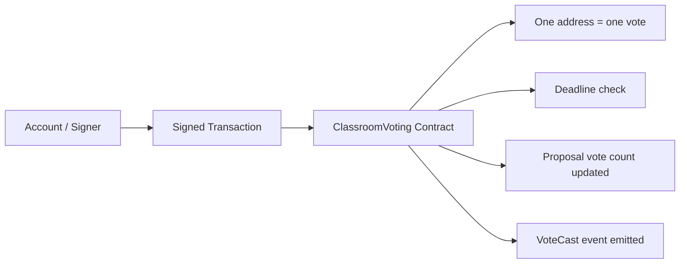
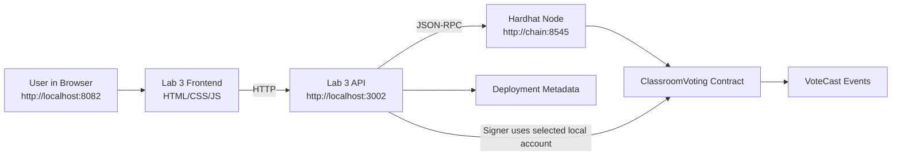
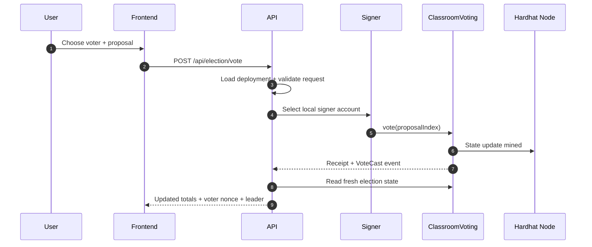
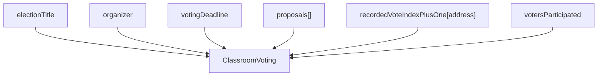
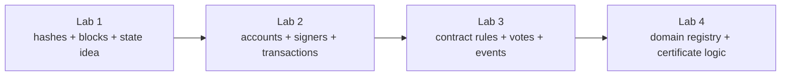

# Lab 3 Master Guide (Classroom Voting DApp)

Goal: move from account-only transactions into the first full smart-contract DApp by deploying, reading, and writing to a classroom voting contract.

## 1. Why This Is the Right Lab 3

Lab 1 introduced:
- **hashing** (turning data into a fixed-size code, like a fingerprint for data)
- **blocks** (bundles of transactions/data, chained together)
- **chaining** (linking blocks so each depends on the previous)
- **basic smart-contract state** (storing data in a contract on the blockchain)

Lab 2 introduced:
- **local Ethereum accounts** (unique blockchain addresses you control locally)
- **signers** (accounts that can authorize/send transactions)
- **balances** (amount of ETH each account holds)
- **nonces** (a counter for each account, increases with every transaction)
- **value transfers** (sending ETH from one account to another)

Lab 3 now combines both worlds:
- **a specific account signs the transaction** (the user’s account authorizes the action)
- **the transaction calls a smart contract** (instead of just sending ETH, it triggers contract code)
- **the contract decides whether the action is valid** (rules are enforced by code, not just the UI)
- **the shared on-chain state changes only if the rule is satisfied** (contract updates data only if all conditions are met)

From the candidate ideas, **decentralized voting** is the best continuation because it makes the contract rule visible immediately:

- **one address = one vote** (each account can only vote once, enforced by the contract)
- **proposals live on-chain** (the list of choices is stored in the contract, not just the UI)
- **vote totals live on-chain** (the contract keeps the official count)
- **voting stops after a deadline** (the contract won’t accept votes after a set time)

That gives you your first real example of “a transaction that is not just money movement, but governed logic.”

---

## 2. What You Will Learn

By the end of Lab 3, you should be able to explain:
- how a deployed contract is different from a normal account
- how a contract call differs from a plain ETH transfer
- why smart-contract rules are stronger than frontend validation alone
- how events help reconstruct history after transactions
- how one address = one vote is enforced on-chain
- how a deadline changes contract behavior over time

You should also be able to run the lab, cast votes from different local accounts, and explain the resulting nonce, event, and proposal-count changes.

---

## 3. Big Picture

Lab 3 has 5 practical parts:
1. compile and deploy the `ClassroomVoting` contract
2. read election status and proposals through the API
3. choose a local signer account
4. cast one vote from that account
5. observe updated proposal totals, voter state, and vote history

---

## 4. One-Minute Story

Imagine the class is deciding which blockchain use case should be developed next.

There are three proposals:
- certificate verification
- supply chain transparency
- campus voting system

Each local account can vote once.

When you vote from a local account:
- the account signs a transaction
- the contract checks whether that address already voted
- the contract checks whether the deadline is still open
- the selected proposal gains one vote
- the contract emits an event
- the frontend reloads the new state

That is a clean first DApp because you can see both the **transaction** and the **contract rule**.

---

## 5. Core Concept Diagram



How to read it:
- the account still starts the transaction
- but the contract now applies rules before state changes
- state and event history both become part of the learning outcome

---

## 6. Lab 3 Architecture



What this means:
- the frontend never talks directly to the contract
- the API reads deployment metadata to find the contract address
- the selected local account signs the vote transaction
- the contract updates proposal totals and emits an event

---

## 7. Transaction Lifecycle



---

## 8. Contract State Model



Why this matters:
- proposals are not stored in the frontend
- who voted is not tracked in the browser only
- the contract is the source of truth

---

## 9. What Was Added or Changed

### New files added
- `docs/lab3/Lab3.md`
- `labs/lab3/blockchain/package.json`
- `labs/lab3/blockchain/hardhat.config.js`
- `labs/lab3/blockchain/contracts/ClassroomVoting.sol`
- `labs/lab3/blockchain/scripts/deploy.js`
- `labs/lab3/blockchain/test/ClassroomVoting.test.js`
- `labs/lab3/api/package.json`
- `labs/lab3/api/src/server.js`
- `labs/lab3/frontend/index.html`
- `labs/lab3/frontend/app.js`
- `labs/lab3/frontend/styles.css`

### Existing files updated
- `docker-compose.yml`
- `README.md`
- `docs/labs/ROADMAP.md`
- `labs/lab3/README.md`

Why these changes matter:
- Lab 3 needs its own deployable contract and deployment metadata
- the API needs to translate classroom actions into contract reads and writes
- the frontend needs to expose contract rules and state, not just send a form
- Compose needs dedicated Lab 3 services while still reusing the shared local chain

---

## 10. Lab 3 Services and Their Jobs

### `chain`
- runs the local Hardhat blockchain
- gives us funded local accounts
- stores the contract state in memory

### `lab3-deployer`
- compiles the Solidity contract
- deploys `ClassroomVoting`
- writes deployment metadata into `labs/lab3/blockchain/deployments/localhost.json`

### `lab3-api`
- reads the deployed contract
- reads proposals, voter state, and event history
- signs vote transactions with selected local accounts

### `lab3-frontend`
- shows election status
- shows available voter accounts
- lets you cast votes
- visualizes updated state and recent events

---

## 11. Step-by-Step: Run Lab 3

## Step 0: Prerequisites
- Docker Desktop running
- project folder opened

## Step 1: Start the shared chain and Lab 3 services

```bash
docker compose up -d chain lab3-api lab3-frontend
```

## Step 2: Deploy the voting contract

```bash
docker compose run --rm lab3-deployer
```

This is required because Lab 3 depends on a real deployed contract.

## Step 3: Open the frontend
- `http://localhost:8082`

## Step 4: Check API health
- `http://localhost:3002/api/health`

Expected:
- `ok: true`
- `chainId: 31337`
- current `blockNumber`

## Step 5: Observe initial election state

You should notice:
- a contract address exists
- the election title is visible
- proposals all start at `0` votes
- no voter has voted yet

## Step 6: Cast the first vote

Example:
- voter: `Account 2`
- proposal: `Certificate verification`

## Step 7: Observe the changes

You should confirm:
- the voter nonce increased by 1
- the selected proposal count increased by 1
- that voter is now marked as already voted
- a vote event appears in history
- the leader panel updates

---

## 12. API Endpoints in This Lab

### `GET /api/health`
Purpose:
- prove the API can reach the chain
- report whether Lab 3 deployment metadata exists

### `GET /api/foundation`
Purpose:
- provide teaching content, objectives, rules, and stages to the frontend

### `GET /api/accounts`
Purpose:
- return the local Hardhat accounts
- include balance, nonce, and vote status when the contract is deployed

### `GET /api/election`
Purpose:
- return the main election snapshot
- title
- organizer
- deadline
- proposals
- leader
- latest block

### `GET /api/election/history`
Purpose:
- reconstruct recent vote history from `VoteCast` events

### `POST /api/election/vote`
Purpose:
- send a vote transaction from the selected local account
- return before/after voter and proposal state

---

## 13. File-by-File Explanation

## A. `labs/lab3/blockchain/contracts/ClassroomVoting.sol`

This is the contract at the center of the lab.

Important state variables:
- `organizer`: the deployer address
- `electionTitle`: the visible classroom election label
- `votingDeadline`: the cutoff time for voting
- `votersParticipated`: number of unique voters
- `proposals`: the list of proposal names and vote totals
- `recordedVoteIndexPlusOne`: tracks whether an address already voted

Important functions:
- `proposalCount()`: returns how many proposals exist
- `isVotingOpen()`: returns whether the deadline has passed
- `remainingSeconds()`: returns how much time is left
- `hasVoted(address)`: checks if an address has voted
- `voteInfo(address)`: returns whether the address voted and for which proposal
- `getProposal(index)`: returns proposal name and vote count
- `currentLeader()`: calculates the proposal currently leading
- `vote(proposalIndex)`: applies the voting rule and updates state

Important events:
- `ProposalCreated`: emitted when the contract is initialized with proposals
- `VoteCast`: emitted every time a valid vote succeeds

Why the design is good for teaching:
- the contract is small enough to read in one session
- the rules are visible and concrete
- the revert paths are easy to demonstrate

## B. `labs/lab3/blockchain/scripts/deploy.js`

Purpose:
- deploy the contract with a classroom title
- inject a default set of proposals
- set a voting duration
- save deployment metadata for the API

Important outputs:
- contract address
- organizer address
- deployed block
- proposal names

## C. `labs/lab3/blockchain/test/ClassroomVoting.test.js`

Purpose:
- prove the contract enforces the main voting rules

Covered behaviors:
- proposal list exists after deployment
- one valid vote increments the chosen proposal
- double voting is rejected
- voting after the deadline is rejected

## D. `labs/lab3/api/src/server.js`

This is the backend bridge between the browser and the voting contract.

Important helpers:
- `readJson(filePath)`: reads deployment and artifact files
- `getDeployment()`: loads the Lab 3 deployment metadata
- `getVotingArtifact()`: loads the compiled ABI
- `buildProvider()`: connects to Hardhat RPC
- `buildAccountCatalog(provider)`: maps unlocked Hardhat accounts into labeled classroom signers
- `findAccount(catalog, address)`: locates the chosen signer account
- `getVotingContract(withSignerAddress)`: builds either a read-only or signer-connected contract
- `getElectionSummary(contract, deployment)`: builds the main contract state snapshot
- `getAccountsSnapshot(provider, contract)`: combines account info with vote status
- `getVoteHistory(contract, deployment, provider)`: reconstructs recent vote events
- `getLatestBlockSummary(provider)`: reads current block state

Why the API exists:
- the browser stays simple
- you can focus on blockchain concepts instead of low-level RPC details
- errors become clearer and easier to understand

## E. `labs/lab3/frontend/index.html`

Purpose:
- define a teaching-focused layout

Main sections:
- hero
- why voting is the right next step
- concept repair
- election status
- voter accounts
- proposal board
- voting form
- before/after result panel
- contract interaction path
- vote history

## F. `labs/lab3/frontend/app.js`

Purpose:
- drive the whole UI state

Important functions:
- `addEvent(message, type)`: appends runtime events to the feed
- `setFlow(activeNodes, hint)`: highlights the current interaction path
- `tracePath(path, hint)`: animates the transaction flow
- `renderElection(election, latestBlock)`: renders the main election board
- `renderAccounts(accounts)`: shows nonce and vote state per account
- `populateVoterSelect(accounts)`: fills the voter chooser
- `selectProposal(index)`: stores the chosen proposal in runtime state
- `renderProposals(proposals)`: shows proposal cards and totals
- `renderHistory(history)`: renders recent `VoteCast` events
- `renderResult(result)`: shows before/after transaction results
- `loadHealth()`, `loadAccounts()`, `loadElection()`, `loadHistory()`: fetch state from the API
- `refreshDashboard()`: refreshes all important Lab 3 state
- `submitVote(event)`: sends the vote transaction and reloads the UI
- `bootstrap()`: initializes the lab

## G. `labs/lab3/frontend/styles.css`

Purpose:
- define the visual language of Lab 3

What it emphasizes:
- proposal selection
- visible election status
- before/after contract effects
- event history
- contract path animation

---

## 14. Questions to Answer After One Successful Vote

After one successful vote, answer the following:

1. Which account nonce changed?
2. Did any ETH move between two local accounts?
3. Which proposal count changed?
4. Why is the proposal total stored on-chain instead of in the browser?
5. What would happen if the same address tried to vote again?
6. What is the role of the `VoteCast` event?

These questions help you separate:
- account-level transaction mechanics
- contract-level rule enforcement
- event-level history reconstruction

---

## 15. Suggested Self-Guided Flow

1. Start with the election status panel and proposal board.
2. Confirm that proposals live inside the contract.
3. Review the local voter accounts and their initial nonce values.
4. Choose one account and one proposal.
5. Send a vote.
6. Inspect the before/after panel.
7. Inspect the updated proposal total.
8. Inspect the vote history list.
9. Confirm why the same voter can no longer vote again.
10. Connect this flow to a later registry-style contract where on-chain rules also matter.

---

## 16. Common Misunderstandings to Correct

### "The browser prevents double voting"
Not really.
The browser may help, but the contract is what truly enforces the rule.

### "Voting is just a UI update"
Wrong.
The vote is a real blockchain transaction that changes contract state.

### "If the page is refreshed, the result disappears"
Wrong.
The state lives on-chain, so refreshing the page only re-reads it.

### "Events store the full application state"
Not exactly.
Events are history signals. The authoritative state still lives in contract storage.

---

## 17. Troubleshooting

### Frontend opens but shows deployment warning

Run:

```bash
docker compose run --rm lab3-deployer
```

### API health works but voting fails

Check:

```bash
docker compose logs lab3-api
docker compose logs chain
```

### Chain was restarted and Lab 3 stopped working

That is expected.
The chain is in-memory, so contract state is lost after restart.

Re-run:

```bash
docker compose up -d chain lab3-api lab3-frontend
docker compose run --rm lab3-deployer
```

### Stop Lab 3

```bash
docker compose stop lab3-api lab3-frontend chain
```

---

## 18. Assignment for You

### Title
Voting Contract Observation and Extension Exercise

### Task
Use the Lab 3 frontend to cast at least three votes from three different local accounts, then document the final election state.

Record:
- which account voted for which proposal
- voter nonce before and after
- proposal count before and after
- block number of each vote
- resulting leader after each vote

### Required analysis questions

1. Why does one address = one vote work even if the frontend is modified?
2. What is the difference between a contract event and contract storage?
3. Why does the voter nonce change while the organizer nonce does not?
4. What happens if the election deadline passes and a new vote is attempted?

### Required modification

Implement one of the following:
- add a tie-detection message in the frontend
- add a “winner after close” section in the API/frontend
- add a new contract test for invalid proposal selection

This keeps the assignment close to Lab 3 while forcing you to read both contract logic and UI behavior.

---

## 19. Bridge to Lab 4



Why this progression works:
- Lab 1 taught what blockchain state means
- Lab 2 taught who sends transactions
- Lab 3 taught how contract rules govern transactions
- Lab 4 can now safely move into a more domain-specific registry use case

---

## 20. Final Checklist

You are ready to leave Lab 3 if you can:
- compile and deploy the Lab 3 contract
- explain the difference between an ETH transfer and a contract call
- show why one address = one vote is enforced on-chain
- explain the purpose of the deadline
- explain the purpose of `VoteCast` events
- read nonce, block, proposal count, and leader changes after a vote

## Glossary of Terms (All Labs)

| Term                        | Explanation                                                                                 |
|-----------------------------|--------------------------------------------------------------------------------------------|
| Hashing                     | Turning data into a unique fixed-size code (like a fingerprint for data)                    |
| Block                       | A bundle of transactions/data, linked to previous blocks                                    |
| Chaining                    | Linking blocks so each depends on the previous, forming a chain                             |
| Smart Contract State        | Data stored inside a contract on the blockchain                                             |
| Local Ethereum Account      | A blockchain address you control on your computer                                           |
| Signer                      | An account that can authorize (sign) transactions                                          |
| Balance                     | The amount of ETH (Ether) an account holds                                                 |
| Nonce                       | A counter for each account, increases with every transaction                               |
| Value Transfer              | Sending ETH from one account to another                                                    |
| Transaction                 | An action sent to the blockchain (e.g., sending ETH, calling a contract)                   |
| Smart Contract              | Code deployed on the blockchain that enforces rules                                        |
| Contract Call               | Sending a transaction to a contract to trigger its logic                                   |
| Proposal                    | An option to vote for in the election                                                      |
| Vote                        | A transaction that records a user’s choice on-chain                                        |
| Event                       | A log emitted by the contract (e.g., VoteCast) to signal something happened               |
| Deadline                    | The time after which voting is closed                                                      |
| Deployment Metadata         | Info about where and how the contract is deployed                                          |
| Frontend                    | The user interface (browser app)                                                           |
| API                         | The backend server that talks to the blockchain and serves data to the frontend            |
| Chain                       | The blockchain network (here, the local Hardhat node)                                      |
| On-chain                    | Data or logic that lives on the blockchain, not just in the UI or backend                  |
| Decentralized Application   | (DApp) An app where the main logic and data are enforced by blockchain smart contracts      |
| VoteCast Event              | A specific event emitted by the contract when a vote is successfully cast                  |
| ProposalCreated Event       | An event emitted when proposals are initialized in the contract                            |
| Organizer                   | The account that deployed the contract and manages the election                            |
| VotersParticipated          | The number of unique voters who have voted in the election                                 |
| RecordedVoteIndexPlusOne    | Contract mapping to track if an address has voted and for which proposal                   |
| Contract Storage            | The permanent data held by the contract on the blockchain                                  |
| Contract Event              | A log entry emitted by the contract, useful for tracking history but not storing state     |
| Hardhat Node                | A local Ethereum blockchain used for development and testing                               |
| Docker Compose              | A tool to run multiple services (blockchain, API, frontend) together for the lab           |
| Deployment Script           | Code that deploys the contract and sets up initial state                                   |
| Test Script                 | Code that checks if the contract rules work as expected                                    |
| Voting Deadline             | The cutoff time after which no more votes are accepted                                     |
| Proposal Count              | The number of proposals available in the election                                          |
| Current Leader              | The proposal currently leading in vote count                                               |
| Vote History                | The list of all votes cast, reconstructed from contract events                             |
| Nonce (again)               | (Repeated for emphasis) The transaction count for an account, increases with each action   |
| Contract Address            | The unique blockchain address where the contract is deployed                               |
| ABI (Application Binary Interface) | The description of the contract’s functions and events, needed to interact with it   |
| JSON-RPC                    | The protocol used by the API to communicate with the blockchain                            |
| Localhost                   | The local machine (your computer) running the blockchain and services                      |
| State Update                | A change in the contract’s stored data as a result of a transaction                        |
| Revert                      | When a contract rejects a transaction and undoes any changes                               |
| Contract Rule               | A rule enforced by the contract code (e.g., one address = one vote)                        |
| Source of Truth             | The authoritative place where data is stored (here, the contract on-chain)                 |
