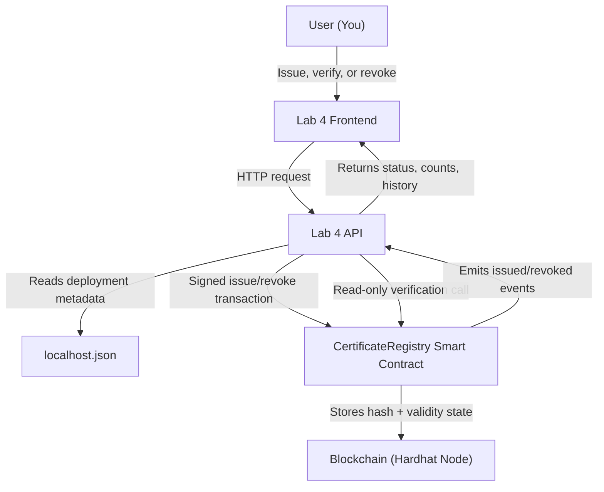
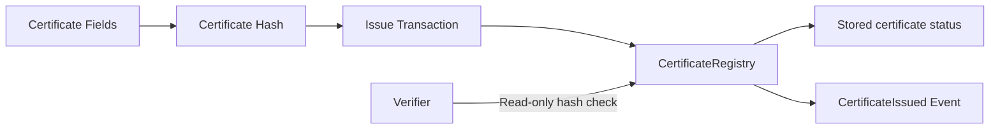
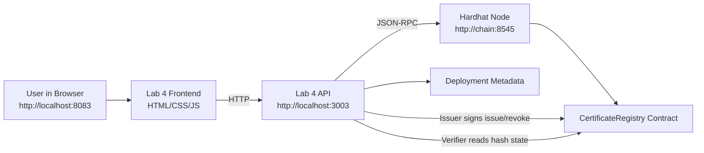
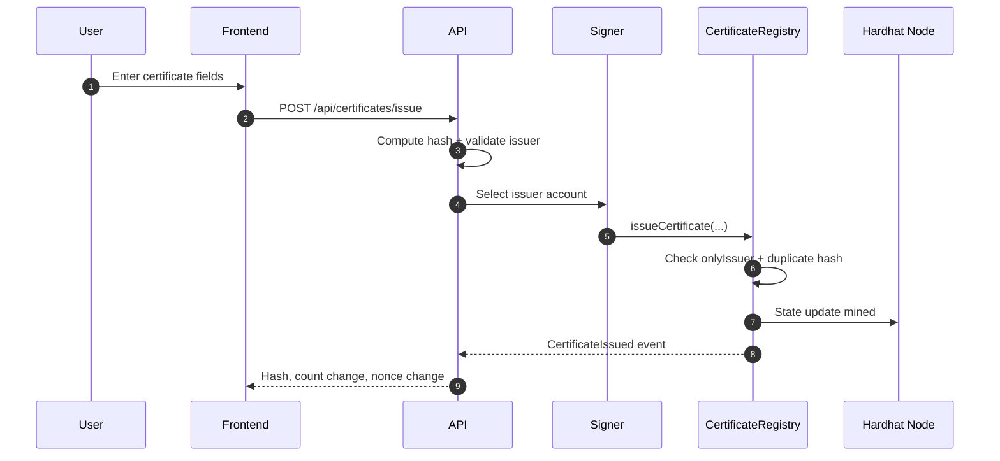
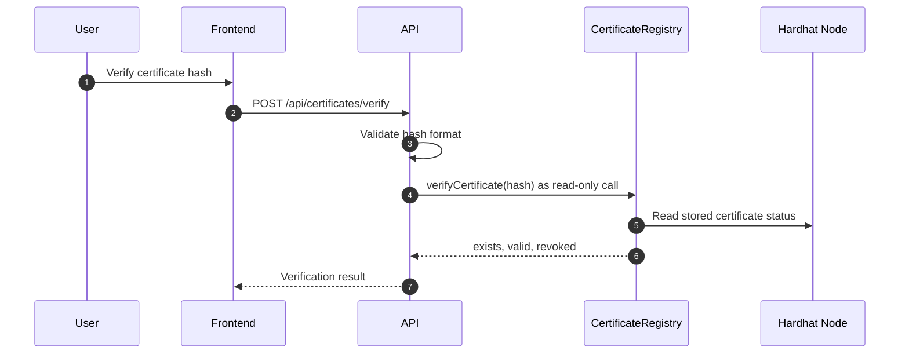
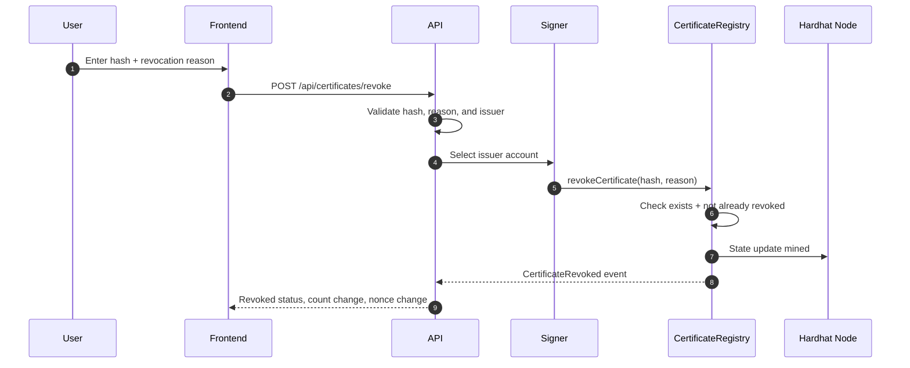
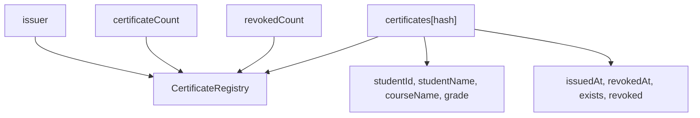
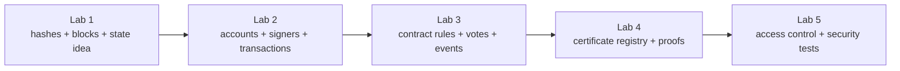

# Lab 4 Master Guide (Certificate Registry + Proof Mechanisms)

Goal: move from a voting DApp into a domain registry where a trusted issuer records certificate hashes, anyone can verify them, and the class compares the major proof mechanisms used by blockchain networks.

## Visual Overview: How Lab 4 Works



The important distinction:
- issuing and revoking are transactions because they change state
- verifying is a read-only call because it only checks existing state

---

## 1. Why This Is the Right Lab 4

Lab 1 introduced hashes, blocks, chaining, and the idea of shared state.

Lab 2 introduced accounts, signers, balances, nonces, and native ETH transfers.

Lab 3 introduced a deployed smart contract with rules, events, and user actions.

### How Lab 4 Differs from the Previous Labs

| Lab | Main focus | What was missing before Lab 4 |
|---|---|---|
| Lab 1 | Hashes, blocks, chaining, and basic shared state | No real user roles or practical registry workflow |
| Lab 2 | Accounts, signers, balances, nonces, and ETH transfers | No smart-contract business rule |
| Lab 3 | A voting contract where many accounts follow the same voting rule | No trusted issuer, public verification, or revocation model |
| Lab 4 | A certificate registry with issuer-only writes and public verification | Now connects application rules with proof mechanism comparison |

The major shift is that Lab 4 is no longer only about "an account calls a contract." It introduces a real-world trust pattern:
- one account is the trusted issuer
- the issuer can write certificate records
- everyone else can verify records without changing chain state
- revocation changes certificate validity while preserving history
- proof mechanisms explain how the blockchain orders and secures blocks underneath the contract

Lab 4 now applies those ideas to a useful registry:
- a certificate is represented by a deterministic hash
- only the issuer can write new certificate records
- anyone can verify whether a certificate hash exists
- revocation changes validity without deleting the history
- events create an audit trail of issued and revoked records

This is close to a real blockchain use case because the chain is not storing a PDF. It stores proof that a specific certificate fingerprint was issued by a specific registry.

---

## 2. Proof Mechanisms Covered in This Lab

Consensus mechanisms decide who can order blocks and how expensive cheating should be. The certificate contract decides whether an application action is allowed after a transaction reaches the chain.

| Mechanism | Resource Used | Energy Profile | Decentralization | Security Model |
|---|---|---|---|---|
| PoW | Compute | Very High | High | Hash difficulty |
| PoS | Capital (stake) | Low | High | Economic penalties |
| PoA | Identity | Very Low | Low | Trusted validators |
| PoC | Storage | Low | Medium | Disk commitment |
| PoH | Time (hash chain) | Low | High (with PoS) | Verifiable ordering |
| PoI | Activity + Stake | Low | Medium | Behavioral scoring |
| PoCo | Useful work | Low | Medium | Contribution validation |
| PoR | Reputation | Low | Medium-Low | Trust history |

Classroom takeaway:
- PoW spends computation to make block production expensive.
- PoS risks stake to make dishonest behavior economically expensive.
- PoA relies on known validators, so it is efficient but less decentralized.
- PoC uses storage commitment instead of raw computation.
- PoH is mainly a verifiable ordering clock and is commonly paired with another consensus/security model.
- PoI, PoCo, and PoR show that not every proof model is based on energy or money; some use activity, useful contribution, or reputation.

---

## 3. What You Will Learn

By the end of Lab 4, you should be able to explain:
- why certificate hashes are stored instead of full documents
- why only the issuer can write to the registry
- why verification does not need a transaction
- how revocation differs from deletion
- how contract events support audit history
- how proof mechanisms compare by resource, energy, decentralization, and security model

You should also be able to run the lab, issue a new certificate, verify its hash, revoke it, and explain the nonce, count, event, and status changes.

---

## 4. Big Picture

Lab 4 has 6 practical parts:
1. compile and deploy the `CertificateRegistry` contract
2. inspect the sample certificate issued during deployment
3. issue a new certificate hash from the issuer account
4. verify the hash without sending a transaction
5. revoke a certificate from the issuer account
6. explain where the proof mechanisms fit in the blockchain stack

---

## 5. One-Minute Story

Imagine the academy wants employers to verify certificates without calling the registrar.

The issuer records a hash of certificate fields:
- student ID
- student name
- course name
- grade

When a verifier receives a certificate, they check the hash against the registry.

If the hash exists and is not revoked, the certificate is valid. If the hash is missing, it was never issued by this registry. If it exists but is revoked, the certificate is historical but no longer valid.

---

## 6. Core Concept Diagram



How to read it:
- the hash is the fingerprint of the certificate data
- the issuer writes the hash to the registry
- a verifier checks the hash later without modifying the chain

---

## 7. Lab 4 Architecture



What this means:
- the frontend never talks directly to the contract
- the API reads deployment metadata to find the contract address
- only the issuer account can write certificate status
- verification is a read-only contract call

---

## 8. Transaction and Verification Lifecycle

Lab 4 has three different lifecycle types. This is important because people often call everything a "transaction", but only some actions actually write to the blockchain.

| Action | Endpoint | Blockchain type | Who signs? | What changes? |
|---|---|---|---|---|
| Issue certificate | `POST /api/certificates/issue` | State-changing transaction | Issuer account | new certificate record, `certificateCount`, issuer nonce, event history |
| Verify certificate | `POST /api/certificates/verify` | Read-only contract call | Nobody signs a transaction | nothing changes; the API only reads `exists`, `valid`, `revoked` |
| Revoke certificate | `POST /api/certificates/revoke` | State-changing transaction | Issuer account | certificate status, `revokedCount`, issuer nonce, event history |

The lifecycle you should explain in class:
- **Issue** creates the certificate record.
- **Verify** reads the certificate record.
- **Revoke** changes the certificate status without deleting the record.

### Issue Lifecycle



What happens:
1. The user enters certificate fields in the frontend.
2. The API computes a deterministic `certificateHash`.
3. The API checks that the selected account is the issuer.
4. The issuer signs a transaction calling `issueCertificate`.
5. The contract checks:
   - sender is the issuer
   - hash is not zero
   - fields are not empty
   - hash was not issued before
6. The contract stores the certificate record.
7. `certificateCount` increases by 1.
8. The issuer nonce increases by 1.
9. A `CertificateIssued` event is emitted.
10. The frontend shows transaction hash, block number, nonce change, and registry count change.

Frontend output to point at:
- **Transaction hash**: proof that a write transaction was submitted.
- **Block number**: where the write was mined.
- **Nonce before -> after**: proves the issuer sent a transaction.
- **Registry count before -> after**: proves contract storage changed.
- **Certificate hash**: the fingerprint can be verified later.

### Verification Lifecycle



What happens:
1. The user provides a certificate hash.
2. The API checks that the hash is a valid `bytes32` hex value.
3. The API calls `verifyCertificate(hash)`.
4. No signer is needed because this is not a write.
5. No transaction is mined.
6. No nonce changes.
7. The contract returns one of three teaching states:
   - `exists=false`, `valid=false`, `revoked=false`: not found
   - `exists=true`, `valid=true`, `revoked=false`: valid certificate
   - `exists=true`, `valid=false`, `revoked=true`: revoked certificate

Frontend output to point at:
- **Valid**: the hash exists and has not been revoked.
- **Not found**: the registry has no record for this hash.
- **Revoked**: the hash exists, but it is no longer valid.
- **Read at block**: tells which chain state was read.
- **No transaction hash**: because verification did not change state.

### Revoke Lifecycle



What happens:
1. The user submits a certificate hash and a reason.
2. The API checks that the selected account is the issuer.
3. The issuer signs a transaction calling `revokeCertificate`.
4. The contract checks:
   - certificate exists
   - certificate is not already revoked
   - reason is not empty
5. The contract keeps the certificate record but sets `revoked=true`.
6. `revokedAt` is set to the current block timestamp.
7. `revokedCount` increases by 1.
8. The issuer nonce increases by 1.
9. A `CertificateRevoked` event is emitted.
10. Verification after revocation returns `exists=true`, `valid=false`, `revoked=true`.

Frontend output to point at:
- **Revoked count before -> after**: proves registry status changed.
- **Nonce before -> after**: proves the issuer sent a transaction.
- **Certificate remains stored**: the record was not deleted.
- **Valid becomes false**: the certificate can no longer be trusted as active.
- **Event history**: shows the revoke happened after the issue.

### One-Line Teaching Summary

Use this sentence during the demo:

> Issue and revoke are transactions because they change contract storage. Verify is only a read because it checks storage without changing it.

---

## 9. Contract State Model



Why this matters:
- the certificate hash is the lookup key
- existence and validity are not the same thing
- revocation preserves history while changing status

---

## 10. What Was Added or Changed

### New files added
- `docs/lab4/Lab4.md`
- `labs/lab4/blockchain/package.json`
- `labs/lab4/blockchain/hardhat.config.js`
- `labs/lab4/blockchain/contracts/CertificateRegistry.sol`
- `labs/lab4/blockchain/scripts/deploy.js`
- `labs/lab4/blockchain/test/CertificateRegistry.test.js`
- `labs/lab4/api/package.json`
- `labs/lab4/api/src/server.js`
- `labs/lab4/frontend/index.html`
- `labs/lab4/frontend/app.js`
- `labs/lab4/frontend/styles.css`

### Existing files updated
- `docker-compose.yml`
- `README.md`
- `docs/labs/ROADMAP.md`
- `labs/lab4/README.md`

Why these changes matter:
- Lab 4 needs its own deployable registry contract
- the API needs issue, verify, revoke, history, and proof table endpoints
- the frontend needs to show both practical registry state and proof mechanism comparison
- Compose needs dedicated Lab 4 services while still reusing the shared local chain

---

## 11. Lab 4 Services and Their Jobs

### `chain`
- runs the local Hardhat blockchain
- gives us funded local accounts
- stores Lab 4 contract state in memory

### `lab4-deployer`
- compiles `CertificateRegistry`
- deploys the registry
- issues one sample certificate
- writes deployment metadata into `labs/lab4/blockchain/deployments/localhost.json`

### `lab4-api`
- reads registry state
- computes certificate hashes
- signs issue and revoke transactions with the issuer account
- verifies hashes with read-only calls
- exposes the proof mechanism comparison table

### `lab4-frontend`
- shows proof mechanism comparison
- shows issuer and local account state
- lets you issue, verify, and revoke certificates
- visualizes transaction flow and registry event history

---

## 12. Step-by-Step: Run Lab 4

## Step 0: Prerequisites
- Docker Desktop running
- project folder opened

## Step 1: Start the shared chain and Lab 4 services

```bash
docker compose up -d chain lab4-api lab4-frontend
```

## Step 2: Deploy the certificate registry

```bash
docker compose run --rm lab4-deployer
```

This is required because Lab 4 depends on a real deployed contract.

## Step 3: Open the frontend
- `http://localhost:8083`

## Step 4: Check API health
- `http://localhost:3003/api/health`

Expected:
- `ok: true`
- `chainId: 31337`
- current `blockNumber`

## Step 5: Verify the sample certificate

Use the sample hash button in the frontend.

You should confirm:
- the hash exists
- the certificate is valid
- verification does not change account nonce

## Step 6: Issue a new certificate

Use the issuer account and default form values or your own values.

You should confirm:
- issuer nonce increased
- certificate count increased
- a `CertificateIssued` event appears
- the new hash can be verified

## Step 7: Revoke a certificate

Use the issuer account and a valid certificate hash.

You should confirm:
- revoked count increased
- the certificate still exists
- `valid` becomes false
- a `CertificateRevoked` event appears

---

## 13. API Endpoints in This Lab

### `GET /api/health`
Purpose:
- prove the API can reach the chain
- report whether Lab 4 deployment metadata exists

### `GET /api/foundation`
Purpose:
- provide objectives, concept cards, lifecycle stages, registry rules, and proof mechanism data

### `GET /api/accounts`
Purpose:
- return local Hardhat accounts
- mark which account is the registry issuer

### `GET /api/registry`
Purpose:
- return registry address, issuer, issued count, revoked count, active count, and sample certificate metadata

### `GET /api/certificates/history`
Purpose:
- reconstruct recent certificate history from `CertificateIssued` and `CertificateRevoked` events

### `POST /api/certificates/issue`
Purpose:
- compute a certificate hash from certificate fields
- send an issue transaction from the issuer account
- return before/after issuer nonce and registry count

### `POST /api/certificates/verify`
Purpose:
- check whether a hash exists, is valid, or is revoked
- perform a read-only contract call

### `POST /api/certificates/revoke`
Purpose:
- send a revoke transaction from the issuer account
- preserve the certificate record while changing its validity

---

## 14. File-by-File Explanation

## A. `labs/lab4/blockchain/contracts/CertificateRegistry.sol`

Important state variables:
- `issuer`: the account allowed to issue and revoke
- `certificateCount`: total issued certificate hashes
- `revokedCount`: total revoked certificates
- `certificates`: mapping from hash to certificate data and status

Important functions:
- `computeCertificateHash(...)`: creates the deterministic certificate fingerprint
- `issueCertificate(...)`: stores a new certificate hash and data
- `revokeCertificate(...)`: marks an existing certificate as revoked
- `verifyCertificate(hash)`: returns exists, valid, revoked, and timestamp status
- `getCertificate(hash)`: returns full stored certificate details

Important events:
- `CertificateIssued`
- `CertificateRevoked`

## B. `labs/lab4/blockchain/scripts/deploy.js`

Purpose:
- deploy the registry
- issue one sample certificate for immediate verification
- save deployment metadata for the API

## C. `labs/lab4/blockchain/test/CertificateRegistry.test.js`

Covered behaviors:
- deployer becomes issuer
- issuer can issue and verify
- duplicate certificate hashes are rejected
- non-issuer issuance is rejected
- issuer can revoke an issued certificate

## D. `labs/lab4/api/src/server.js`

Purpose:
- connect browser actions to the deployed registry
- compute hashes consistently with the contract
- expose proof mechanism concept data
- return readable before/after transaction effects

## E. `labs/lab4/frontend/*`

Purpose:
- provide the practical UI for proof comparison, registry status, issuing, verifying, revoking, and event history

---

## 15. Questions to Answer After One Successful Issue

After issuing a certificate, answer:

1. Which account nonce changed?
2. Did certificate verification change any nonce?
3. What certificate hash was generated?
4. Why is the hash stored instead of a full certificate document?
5. What event was emitted?
6. Why can a verifier trust the registry result more than a screenshot?

---

## 16. Questions to Answer After One Revocation

After revoking a certificate, answer:

1. Does the certificate still exist?
2. Is the certificate still valid?
3. Which count changed: total issued, revoked, or both?
4. Why is revocation better than deleting the record?
5. What would happen if a non-issuer account tried to revoke?

---

## 17. Suggested Self-Guided Flow

1. Start with the proof mechanism table.
2. Explain the difference between consensus security and contract rules.
3. Deploy the registry.
4. Verify the sample certificate hash.
5. Issue a new certificate.
6. Verify the new hash.
7. Revoke the new hash.
8. Verify the same hash again and compare status.
9. Inspect the event history.
10. Connect this lab to Lab 5 access control and security testing.

---

## 18. Common Misunderstandings to Correct

### "The certificate file is stored on-chain"
No. This lab stores a hash and important metadata. Full files are normally stored elsewhere.

### "Verification is a transaction"
Not in this lab. Verification is a read-only call, so it does not cost gas or change nonce on the local chain.

### "Revoked means deleted"
No. Revoked means the record still exists, but it is no longer valid.

### "Proof of Work is the contract rule"
No. Proof mechanisms secure block production. The contract rule controls certificate registry behavior.

---

## 19. Troubleshooting

### Frontend opens but shows deployment warning

Run:

```bash
docker compose run --rm lab4-deployer
```

### API health works but issue/revoke fails

Check:

```bash
docker compose logs lab4-api
docker compose logs chain
```

Also confirm you selected the account marked as issuer.

### Chain was restarted and Lab 4 stopped working

That is expected. The chain is in-memory, so contract state is lost after restart.

Re-run:

```bash
docker compose up -d chain lab4-api lab4-frontend
docker compose run --rm lab4-deployer
```

### Stop Lab 4

```bash
docker compose stop lab4-api lab4-frontend chain
```

---

## 20. Assignment for You

### Title
Certificate Registry Observation and Proof Comparison

### Task
Use the Lab 4 frontend to issue, verify, revoke, and re-verify at least one new certificate.

Record:
- certificate fields used
- generated certificate hash
- issuer nonce before and after issuing
- block number of the issue transaction
- verification result before revocation
- block number of the revoke transaction
- verification result after revocation

### Required analysis questions

1. Why does verification not require the issuer account?
2. Why does revocation preserve the original record?
3. Which proof mechanism from the table is most suitable for a small private academy chain, and why?
4. Which proof mechanism is most energy-intensive, and what security benefit does it buy?
5. Why does PoH need to be understood as ordering support rather than a full replacement for validator security?

### Required modification

Implement one of the following:
- add one more certificate field to the contract and frontend
- add a frontend warning when a non-issuer account is selected
- add a new contract test for revoking a missing hash
- add a short explanation panel for one proof mechanism

---

## 21. Bridge to Lab 5



Why this progression works:
- Lab 4 introduces a trusted issuer rule
- Lab 5 can harden that rule with stronger access control, negative tests, and security thinking

---

## 22. Final Checklist

You are ready to leave Lab 4 if you can:
- compile and deploy the Lab 4 contract
- issue a certificate hash from the issuer account
- verify a certificate hash without sending a transaction
- revoke a certificate and explain exists vs valid
- explain the difference between contract rules and consensus mechanisms
- compare PoW, PoS, PoA, PoC, PoH, PoI, PoCo, and PoR using the table

---

## 23. Small Glossary

### Lab 4 Registry Terms

| Term | Short meaning |
|---|---|
| Certificate Registry | A smart contract that stores certificate hashes and their validity status. |
| Certificate Hash | A fixed-size fingerprint created from certificate fields. |
| Deterministic Hash | A hash that is always the same when the same input fields are used in the same order. |
| Certificate Fields | The data used to describe a certificate, such as student ID, student name, course name, and grade. |
| Issuer | The trusted account allowed to issue and revoke certificates. |
| Verifier | A user or system that checks whether a certificate hash exists and is valid. |
| Verification | A read-only check that returns whether a certificate exists, is valid, or is revoked. |
| Revocation | Marking an existing certificate as no longer valid without deleting its history. |
| Active Certificate | A certificate that exists and has not been revoked. |
| Revoked Certificate | A certificate that still exists in the registry but is no longer valid. |
| `certificateCount` | The total number of certificates issued by the registry. |
| `revokedCount` | The number of issued certificates that were later revoked. |
| `exists` | A contract flag showing that a certificate hash was issued. |
| `valid` | A verification result meaning the certificate exists and is not revoked. |
| `issuedAt` | The block timestamp when the certificate was issued. |
| `revokedAt` | The block timestamp when the certificate was revoked. |
| `CertificateIssued` Event | A contract log emitted when a new certificate hash is stored. |
| `CertificateRevoked` Event | A contract log emitted when a certificate is revoked. |
| Audit Trail | The readable history reconstructed from contract events. |
| Read-only Call | A contract call that reads state without mining a transaction or changing nonce. |
| State-changing Transaction | A signed action that changes contract storage and is mined into a block. |
| Deployment Sample | The example certificate issued by the deploy script so the lab has data immediately. |
| Consensus | The network process for agreeing on block order and valid chain history. |
| Validator | A participant that helps produce or approve blocks, depending on the consensus model. |
| Block Ordering | The agreed sequence of transactions inside blocks. |

### Proof Mechanism Terms

| Proof | Short meaning |
|---|---|
| PoW (Proof of Work) | Uses computational work to make block production expensive and hard to fake. |
| PoS (Proof of Stake) | Uses locked capital as security; dishonest validators risk economic penalties. |
| PoA (Proof of Authority) | Uses known validator identities; efficient, but more centralized. |
| PoC (Proof of Capacity) | Uses committed disk storage as the scarce resource for participation. |
| PoH (Proof of History) | Uses a verifiable hash chain to prove ordering of events over time. |
| PoI (Proof of Importance) | Uses activity plus stake to score which accounts are important to the network. |
| PoCo (Proof of Contribution) | Rewards useful work or contribution instead of arbitrary computation. |
| PoR (Proof of Reputation) | Uses trust history or reputation to influence validator selection or trust. |
| Hash Difficulty | The target that makes PoW mining hard enough to require real compute effort. |
| Stake | Capital locked by validators in PoS systems. |
| Economic Penalty | A loss imposed on validators who break rules or behave dishonestly. |
| Trusted Validator | A known validator whose identity or authority is part of the security model. |
| Disk Commitment | Storage reserved or proven in systems based on capacity. |
| Verifiable Ordering | A way to prove that events happened in a specific sequence. |
| Behavioral Scoring | Ranking participants based on useful or important activity. |
| Contribution Validation | Checking that claimed useful work was actually performed. |
| Trust History | Past behavior used as evidence for future trust. |
